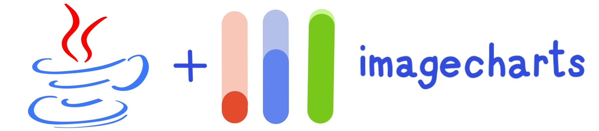

[](#getting-started)

[](https://crates.io/crates/chartjs_image)
[](https://docs.rs/chartjs_image)
[](LICENSE)


Generate [Chart.JS charts](https://www.chartjs.org/docs/latest/) as image and embed them everywhere in emails, pdf reports, chat bots...!

### Getting started

#### 1. Add Chart.js Image to your project

[](https://crates.io/crates/chartjs_image)

Requirements: Rust 1.65+

Add to your `Cargo.toml`:

```toml
[dependencies]
chartjs_image = "6"
```

#### Feature Flags

- **`async`** (default): Enables async methods (`to_buffer()`, `to_file()`, `to_data_uri()`)
- **`blocking`**: Enables blocking/sync methods (`to_buffer_blocking()`, `to_file_blocking()`, `to_data_uri_blocking()`)
- **`full`**: Enables both async and blocking

```toml
# Async only (default)
chartjs_image = "6"

# Blocking only
chartjs_image = { version = "6", default-features = false, features = ["blocking"] }

# Both async and blocking
chartjs_image = { version = "6", features = ["full"] }
```

#### 2. Import ChartJSImage library

```rust
use chartjs_image::ChartJSImage;
```

#### 3. Generate a chart image

```rust
use chartjs_image::ChartJSImage;

fn main() {
    let chart = ChartJSImage::new()
        .chart(r#"{
            "type": "pie",
            "data": {
                "labels": ["Red", "Blue", "Yellow"],
                "datasets": [{
                    "data": [300, 50, 100]
                }]
            }
        }"#)
        .width("600")
        .height("300");

    // Get URL (sync, no HTTP request)
    let url = chart.to_url();
    println!("{}", url);
}
```

```rust
// Async example
use chartjs_image::ChartJSImage;

#[tokio::main]
async fn main() -> Result<(), Box<dyn std::error::Error>> {
    let chart = ChartJSImage::new()
        .chart(r#"{"type":"pie","data":{"labels":["Red","Blue"],"datasets":[{"data":[60,40]}]}}"#)
        .width("600")
        .height("300");

    // Download as bytes
    let buffer = chart.to_buffer().await?;

    // Save to file
    chart.to_file("chart.png").await?;

    // Get as data URI
    let data_uri = chart.to_data_uri().await?;
    // data:image/png;base64,iVBORw0KGgo...

    Ok(())
}
```

<p align="center">
    <a href="https://www.image-charts.com/">
        
    </a>
</p>

-----------------------------------------------------------------------

### Table of Contents

- __[Enterprise support](#enterprise-support)__
- __[On-Premise support](#on-premise-support)__
- __[Constructor](#constructor)__
    - __[Options](#options)__
- __[Methods](#methods)__
    - __[to_url()](#to_url)__
    - __[to_buffer() / to_buffer_blocking()](#to_buffer)__
    - __[to_file() / to_file_blocking()](#to_file)__
    - __[to_data_uri() / to_data_uri_blocking()](#to_data_uri)__
        - __[c(value) - Javascript/JSON definition of the chart. Use a Chart.js configuration object.](#c)__
        - __[chart(value) - Javascript/JSON definition of the chart. Use a Chart.js configuration object.](#chart)__
        - __[width(value) - Width of the chart](#width)__
        - __[height(value) - Height of the chart](#height)__
        - __[backgroundColor(value) - Background of the chart canvas. Accepts rgb (rgb(255,255,120)), colors (red), and url-encoded hex values (%23ff00ff). Abbreviated as &#34;bkg&#34;](#backgroundcolor)__
        - __[bkg(value) - Background of the chart canvas. Accepts rgb (rgb(255,255,120)), colors (red), and url-encoded hex values (%23ff00ff). Abbreviated as &#34;bkg&#34;](#bkg)__
        - __[encoding(value) - Encoding of your &#34;chart&#34; parameter. Accepted values are url and base64.](#encoding)__
        - __[icac(value) - image-charts enterprise `account_id`](#icac)__
        - __[ichm(value) - HMAC-SHA256 signature required to activate paid features](#ichm)__
        - __[icretina(value) - retina mode](#icretina)__

----------------------------------------------------------------------------------------------

### Constructor

> Create an instance with builder pattern. See [usage](#usage)

```rust
// Free usage - default configuration
let chart = ChartJSImage::new();

// Enterprise & Enterprise+ subscriptions
let chart = ChartJSImage::builder()
    .secret("SECRET_KEY")
    .build();

// With custom timeout
let chart = ChartJSImage::builder()
    .secret("SECRET_KEY")
    .timeout(std::time::Duration::from_secs(10))
    .build();

// On-premise subscriptions
let chart = ChartJSImage::builder()
    .protocol("https")
    .host("custom-domain.tld")
    .port(443)
    .pathname("/chart.js/2.8.0")
    .secret("SECRET_KEY")
    .build();
```

- _[Back to Getting started](#getting-started)_
- _[Back to ToC](#table-of-contents)_

----------------------------------------------------------------------------------------------

### Methods

----------------------------------------------------------------------------------------------

<a name="to_url"></a>
#### `to_url()` -> `String`

> Get the full Image-Charts API url (signed and encoded if necessary)

##### Usage

```rust
use chartjs_image::ChartJSImage;

fn main() {
    let url = ChartJSImage::new()
        .chart(r#"{"type":"pie","data":{"labels":["Hello","World"],"datasets":[{"data":[60,40]}]}}"#)
        .width("700")
        .height("300")
        .to_url();

    println!("{}", url);
}
```

- _[Back to Getting started](#getting-started)_
- _[Back to ToC](#table-of-contents)_

----------------------------------------------------------------------------------------------

<a name="to_buffer"></a>
#### `to_buffer()` -> `Result<Vec<u8>, ChartJSImageError>` (async)
#### `to_buffer_blocking()` -> `Result<Vec<u8>, ChartJSImageError>` (blocking)

> Do a request to Image-Charts API with current configuration and yield image bytes

##### Usage (async)

```rust
use chartjs_image::ChartJSImage;

#[tokio::main]
async fn main() -> Result<(), Box<dyn std::error::Error>> {
    let buffer = ChartJSImage::new()
        .chart(r#"{"type":"pie","data":{"labels":["Hello","World"],"datasets":[{"data":[60,40]}]}}"#)
        .width("700")
        .height("300")
        .to_buffer()
        .await?;

    println!("Downloaded {} bytes", buffer.len());
    Ok(())
}
```

##### Usage (blocking)

```rust
use chartjs_image::ChartJSImage;

fn main() -> Result<(), Box<dyn std::error::Error>> {
    let buffer = ChartJSImage::new()
        .chart(r#"{"type":"pie","data":{"labels":["Hello","World"],"datasets":[{"data":[60,40]}]}}"#)
        .width("700")
        .height("300")
        .to_buffer_blocking()?;

    println!("Downloaded {} bytes", buffer.len());
    Ok(())
}
```

- _[Back to Getting started](#getting-started)_
- _[Back to ToC](#table-of-contents)_

----------------------------------------------------------------------------------------------

<a name="to_file"></a>
#### `to_file(path)` -> `Result<(), ChartJSImageError>` (async)
#### `to_file_blocking(path)` -> `Result<(), ChartJSImageError>` (blocking)

> Download chart and save to file

##### Usage (async)

```rust
use chartjs_image::ChartJSImage;

#[tokio::main]
async fn main() -> Result<(), Box<dyn std::error::Error>> {
    ChartJSImage::new()
        .chart(r#"{"type":"pie","data":{"labels":["Hello","World"],"datasets":[{"data":[60,40]}]}}"#)
        .width("700")
        .height("300")
        .to_file("chart.png")
        .await?;

    println!("Chart saved!");
    Ok(())
}
```

- _[Back to Getting started](#getting-started)_
- _[Back to ToC](#table-of-contents)_

----------------------------------------------------------------------------------------------

<a name="to_data_uri"></a>
#### `to_data_uri()` -> `Result<String, ChartJSImageError>` (async)
#### `to_data_uri_blocking()` -> `Result<String, ChartJSImageError>` (blocking)

> Do a request to Image-Charts API with current configuration and yield a base64 encoded [data URI](https://developer.mozilla.org/en-US/docs/Web/HTTP/Basics_of_HTTP/Data_URIs)

##### Usage (async)

```rust
use chartjs_image::ChartJSImage;

#[tokio::main]
async fn main() -> Result<(), Box<dyn std::error::Error>> {
    let data_uri = ChartJSImage::new()
        .chart(r#"{"type":"pie","data":{"labels":["Hello","World"],"datasets":[{"data":[60,40]}]}}"#)
        .width("100")
        .height("100")
        .to_data_uri()
        .await?;

    // Use in HTML: 
    println!("{}", &data_uri[..50]);
    Ok(())
}
```

- _[Back to Getting started](#getting-started)_
- _[Back to ToC](#table-of-contents)_

----------------------------------------------------------------------------------------------

#### Enterprise Support

Image-Charts Enterprise and Enterprise+ subscriptions remove the watermark and enable advanced features like
custom-domain, high-resolution charts, custom fonts, multiple axis and mixed charts.

- [Pricing and plan comparison](https://www.image-charts.com/pricing)
- [Enterprise documentation](https://documentation.image-charts.com/enterprise/)

##### Usage

Once subscribed to a plan you will receive an `ACCOUNT_ID` and a `SECRET_KEY`.
These two parameters are mandatory to sign your request and remove the watermark.
Replace both values in the code example below:

```rust
use chartjs_image::ChartJSImage;

fn main() {
    let url = ChartJSImage::builder()
        .secret("SECRET_KEY")
        .build()
        .chart(r#"{"type":"pie","data":{"labels":["Hello","World"],"datasets":[{"data":[60,40]}]}}"#)
        .width("700")
        .height("190")
        .icretina("1")
        .icac("ACCOUNT_ID")
        .to_url();

    println!("{}", url);
}
```

- _[Back to Getting started](#getting-started)_
- _[Back to ToC](#table-of-contents)_

----------------------------------------------------------------------------------------------

#### On-Premise Support

Image-Charts virtual appliance can be deployed anywhere inside a customer network.


```rust
use chartjs_image::ChartJSImage;

fn main() {
    let url = ChartJSImage::builder()
        .host("custom-domain.tld")
        .secret("SECRET_KEY")
        .build()
        .chart(r#"{"type":"pie","data":{"labels":["Hello","World"],"datasets":[{"data":[60,40]}]}}"#)
        .width("700")
        .height("190")
        .icretina("1")
        .icac("ACCOUNT_ID")
        .to_url();

    println!("{}", url);
    // https://custom-domain.tld/chart.js/2.8.0?c=...&ichm=...
}
```

- _[Back to Getting started](#getting-started)_
- _[Back to ToC](#table-of-contents)_


----------------------------------------------------------------------------------------------

<a name="c"></a>
#### `c( value )` -> [`ChartJSImage`](#constructor)

> Javascript/JSON definition of the chart. Use a Chart.js configuration object.


##### Usage


<a href="https://editor.image-charts.com/#https:/image-charts.com/chart?chd=a%3A30010%2C-30000%2C50000%2C80000%2C20000&chdl=Income&chf=b0%2Clg%2C90%2CEA469EFF%2C1%2C03A9F47C%2C0.4&chl=2014%7C2015%7C2016%7C2017%7C2018&chs=700x300&cht=bvs&chxt=y&c=%7Btype%3A'bar'%2Cdata%3A%7Blabels%3A%5B'Q1'%2C'Q2'%2C'Q3'%2C'Q4'%5D%2Cdatasets%3A%5B%7Blabel%3A'Users'%2Cdata%3A%5B50%2C60%2C70%2C180%5D%7D%2C%7Blabel%3A'Revenue'%2Cdata%3A%5B100%2C200%2C300%2C400%5D%7D%5D%7D%7D" target="_blank">
    <pre>.c("{type:&#39;bar&#39;,data:{labels:[&#39;Q1&#39;,&#39;Q2&#39;,&#39;Q3&#39;,&#39;Q4&#39;],datasets:[{label:&#39;Users&#39;,data:[50,60,70,180]},{label:&#39;Revenue&#39;,data:[100,200,300,400]}]}}")</pre>
</a>

- _[Back to Getting started](#getting-started)_
- _[Back to ToC](#table-of-contents)_


----------------------------------------------------------------------------------------------

<a name="chart"></a>
#### `chart( value )` -> [`ChartJSImage`](#constructor)

> Javascript/JSON definition of the chart. Use a Chart.js configuration object.


##### Usage


<a href="https://editor.image-charts.com/#https:/image-charts.com/chart?chd=a%3A30010%2C-30000%2C50000%2C80000%2C20000&chdl=Income&chf=b0%2Clg%2C90%2CEA469EFF%2C1%2C03A9F47C%2C0.4&chl=2014%7C2015%7C2016%7C2017%7C2018&chs=700x300&cht=bvs&chxt=y&chart=%7Btype%3A'bar'%2Cdata%3A%7Blabels%3A%5B'Q1'%2C'Q2'%2C'Q3'%2C'Q4'%5D%2Cdatasets%3A%5B%7Blabel%3A'Users'%2Cdata%3A%5B50%2C60%2C70%2C180%5D%7D%2C%7Blabel%3A'Revenue'%2Cdata%3A%5B100%2C200%2C300%2C400%5D%7D%5D%7D%7D" target="_blank">
    <pre>.chart("{type:&#39;bar&#39;,data:{labels:[&#39;Q1&#39;,&#39;Q2&#39;,&#39;Q3&#39;,&#39;Q4&#39;],datasets:[{label:&#39;Users&#39;,data:[50,60,70,180]},{label:&#39;Revenue&#39;,data:[100,200,300,400]}]}}")</pre>
</a>

- _[Back to Getting started](#getting-started)_
- _[Back to ToC](#table-of-contents)_


----------------------------------------------------------------------------------------------

<a name="width"></a>
#### `width( value )` -> [`ChartJSImage`](#constructor)

> Width of the chart


##### Usage


<a href="https://editor.image-charts.com/#https:/image-charts.com/chart?chd=a%3A30010%2C-30000%2C50000%2C80000%2C20000&chdl=Income&chf=b0%2Clg%2C90%2CEA469EFF%2C1%2C03A9F47C%2C0.4&chl=2014%7C2015%7C2016%7C2017%7C2018&chs=700x300&cht=bvs&chxt=y&width=400" target="_blank">
    <pre>.width("400")</pre>
</a>

- _[Back to Getting started](#getting-started)_
- _[Back to ToC](#table-of-contents)_


----------------------------------------------------------------------------------------------

<a name="height"></a>
#### `height( value )` -> [`ChartJSImage`](#constructor)

> Height of the chart


##### Usage


<a href="https://editor.image-charts.com/#https:/image-charts.com/chart?chd=a%3A30010%2C-30000%2C50000%2C80000%2C20000&chdl=Income&chf=b0%2Clg%2C90%2CEA469EFF%2C1%2C03A9F47C%2C0.4&chl=2014%7C2015%7C2016%7C2017%7C2018&chs=700x300&cht=bvs&chxt=y&height=300" target="_blank">
    <pre>.height("300")</pre>
</a>

- _[Back to Getting started](#getting-started)_
- _[Back to ToC](#table-of-contents)_


----------------------------------------------------------------------------------------------

<a name="backgroundColor"></a>
#### `backgroundColor( value )` -> [`ChartJSImage`](#constructor)

> Background of the chart canvas. Accepts rgb (rgb(255,255,120)), colors (red), and url-encoded hex values (%23ff00ff). Abbreviated as &#34;bkg&#34;


##### Usage


<a href="https://editor.image-charts.com/#https:/image-charts.com/chart?chd=a%3A30010%2C-30000%2C50000%2C80000%2C20000&chdl=Income&chf=b0%2Clg%2C90%2CEA469EFF%2C1%2C03A9F47C%2C0.4&chl=2014%7C2015%7C2016%7C2017%7C2018&chs=700x300&cht=bvs&chxt=y&backgroundColor=black" target="_blank">
    <pre>.backgroundColor("black")</pre>
</a>
<a href="https://editor.image-charts.com/#https:/image-charts.com/chart?chd=a%3A30010%2C-30000%2C50000%2C80000%2C20000&chdl=Income&chf=b0%2Clg%2C90%2CEA469EFF%2C1%2C03A9F47C%2C0.4&chl=2014%7C2015%7C2016%7C2017%7C2018&chs=700x300&cht=bvs&chxt=y&backgroundColor=rgb(255%2C255%2C120)" target="_blank">
    <pre>.backgroundColor("rgb(255,255,120)")</pre>
</a>
<a href="https://editor.image-charts.com/#https:/image-charts.com/chart?chd=a%3A30010%2C-30000%2C50000%2C80000%2C20000&chdl=Income&chf=b0%2Clg%2C90%2CEA469EFF%2C1%2C03A9F47C%2C0.4&chl=2014%7C2015%7C2016%7C2017%7C2018&chs=700x300&cht=bvs&chxt=y&backgroundColor=%2523ff00ff" target="_blank">
    <pre>.backgroundColor("%23ff00ff")</pre>
</a>

- _[Back to Getting started](#getting-started)_
- _[Back to ToC](#table-of-contents)_


----------------------------------------------------------------------------------------------

<a name="bkg"></a>
#### `bkg( value )` -> [`ChartJSImage`](#constructor)

> Background of the chart canvas. Accepts rgb (rgb(255,255,120)), colors (red), and url-encoded hex values (%23ff00ff). Abbreviated as &#34;bkg&#34;


##### Usage


<a href="https://editor.image-charts.com/#https:/image-charts.com/chart?chd=a%3A30010%2C-30000%2C50000%2C80000%2C20000&chdl=Income&chf=b0%2Clg%2C90%2CEA469EFF%2C1%2C03A9F47C%2C0.4&chl=2014%7C2015%7C2016%7C2017%7C2018&chs=700x300&cht=bvs&chxt=y&bkg=black" target="_blank">
    <pre>.bkg("black")</pre>
</a>
<a href="https://editor.image-charts.com/#https:/image-charts.com/chart?chd=a%3A30010%2C-30000%2C50000%2C80000%2C20000&chdl=Income&chf=b0%2Clg%2C90%2CEA469EFF%2C1%2C03A9F47C%2C0.4&chl=2014%7C2015%7C2016%7C2017%7C2018&chs=700x300&cht=bvs&chxt=y&bkg=rgb(255%2C255%2C120)" target="_blank">
    <pre>.bkg("rgb(255,255,120)")</pre>
</a>
<a href="https://editor.image-charts.com/#https:/image-charts.com/chart?chd=a%3A30010%2C-30000%2C50000%2C80000%2C20000&chdl=Income&chf=b0%2Clg%2C90%2CEA469EFF%2C1%2C03A9F47C%2C0.4&chl=2014%7C2015%7C2016%7C2017%7C2018&chs=700x300&cht=bvs&chxt=y&bkg=%2523ff00ff" target="_blank">
    <pre>.bkg("%23ff00ff")</pre>
</a>

- _[Back to Getting started](#getting-started)_
- _[Back to ToC](#table-of-contents)_


----------------------------------------------------------------------------------------------

<a name="encoding"></a>
#### `encoding( value )` -> [`ChartJSImage`](#constructor)

> Encoding of your &#34;chart&#34; parameter. Accepted values are url and base64.


##### Allowed values: 
<a href="https://editor.image-charts.com/#https:/image-charts.com/chart?chd=a%3A30010%2C-30000%2C50000%2C80000%2C20000&chdl=Income&chf=b0%2Clg%2C90%2CEA469EFF%2C1%2C03A9F47C%2C0.4&chl=2014%7C2015%7C2016%7C2017%7C2018&chs=700x300&cht=bvs&chxt=y&encoding=url" target="_blank">
    <pre>.encoding("url")</pre>
</a>
<a href="https://editor.image-charts.com/#https:/image-charts.com/chart?chd=a%3A30010%2C-30000%2C50000%2C80000%2C20000&chdl=Income&chf=b0%2Clg%2C90%2CEA469EFF%2C1%2C03A9F47C%2C0.4&chl=2014%7C2015%7C2016%7C2017%7C2018&chs=700x300&cht=bvs&chxt=y&encoding=base64" target="_blank">
    <pre>.encoding("base64")</pre>
</a>


- _[Back to Getting started](#getting-started)_
- _[Back to ToC](#table-of-contents)_


----------------------------------------------------------------------------------------------

<a name="icac"></a>
#### `icac( value )` -> [`ChartJSImage`](#constructor)

> image-charts enterprise `account_id`

> [Reference](https://documentation.image-charts.com/enterprise/)


##### Usage


<a href="https://editor.image-charts.com/#https:/image-charts.com/chart?chd=a%3A30010%2C-30000%2C50000%2C80000%2C20000&chdl=Income&chf=b0%2Clg%2C90%2CEA469EFF%2C1%2C03A9F47C%2C0.4&chl=2014%7C2015%7C2016%7C2017%7C2018&chs=700x300&cht=bvs&chxt=y&icac=accountId" target="_blank">
    <pre>.icac("accountId")</pre>
</a>

- _[Back to Getting started](#getting-started)_
- _[Back to ToC](#table-of-contents)_


----------------------------------------------------------------------------------------------

<a name="ichm"></a>
#### `ichm( value )` -> [`ChartJSImage`](#constructor)

> HMAC-SHA256 signature required to activate paid features

> [Reference](https://documentation.image-charts.com/enterprise/)


##### Usage


<a href="https://editor.image-charts.com/#https:/image-charts.com/chart?chd=a%3A30010%2C-30000%2C50000%2C80000%2C20000&chdl=Income&chf=b0%2Clg%2C90%2CEA469EFF%2C1%2C03A9F47C%2C0.4&chl=2014%7C2015%7C2016%7C2017%7C2018&chs=700x300&cht=bvs&chxt=y&ichm=0785cf22a0381c2e0239e27c126de4181f501d117c2c81745611e9db928b0376" target="_blank">
    <pre>.ichm("0785cf22a0381c2e0239e27c126de4181f501d117c2c81745611e9db928b0376")</pre>
</a>

- _[Back to Getting started](#getting-started)_
- _[Back to ToC](#table-of-contents)_


----------------------------------------------------------------------------------------------

<a name="icretina"></a>
#### `icretina( value )` -> [`ChartJSImage`](#constructor)

> retina mode

> [Reference](https://documentation.image-charts.com/reference/retina/)


##### Allowed values: 
<a href="https://editor.image-charts.com/#https:/image-charts.com/chart?chd=a%3A30010%2C-30000%2C50000%2C80000%2C20000&chdl=Income&chf=b0%2Clg%2C90%2CEA469EFF%2C1%2C03A9F47C%2C0.4&chl=2014%7C2015%7C2016%7C2017%7C2018&chs=700x300&cht=bvs&chxt=y&icretina=0" target="_blank">
    <pre>.icretina("0")</pre>
</a>
<a href="https://editor.image-charts.com/#https:/image-charts.com/chart?chd=a%3A30010%2C-30000%2C50000%2C80000%2C20000&chdl=Income&chf=b0%2Clg%2C90%2CEA469EFF%2C1%2C03A9F47C%2C0.4&chl=2014%7C2015%7C2016%7C2017%7C2018&chs=700x300&cht=bvs&chxt=y&icretina=1" target="_blank">
    <pre>.icretina("1")</pre>
</a>


- _[Back to Getting started](#getting-started)_
- _[Back to ToC](#table-of-contents)_


